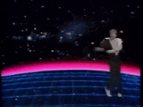

<h1>  Hello I'm Sarang</h1>

<h3 align="center">I can do back-end development</h3>

<h3 align="center">Made Augmented python library (updated for latest py version) </h3>

  

- 🌱 I’m currently learning **Neural Networks** and **Embedded Systems**

- 👨‍💻 All of my projects are available [here](https://github.com/SarangT123?tab=repositories)

- 💬 Ask me about **Anything really**

- 📫 How to reach me **sarang.thekkedathpr@gmail.com**

- ⚡ Education  **National Institute of Technology Calicut**

